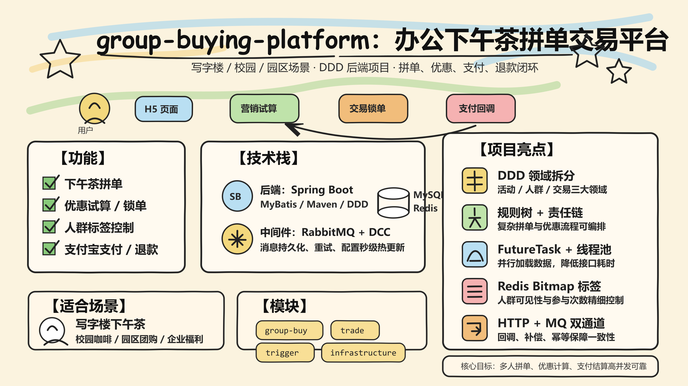

# group-buying-platform - 办公下午茶拼单交易平台

<div align="center">


面向写字楼、园区和校园场景的下午茶拼单交易平台，覆盖活动试算、营销锁单、订单结算、逆向退款、微信扫码登录与支付宝支付等核心流程。

[功能特性](#-功能特性) • [技术栈](#-技术栈) • [业务架构](#-业务架构) • [快速开始](#-快速开始) • [核心设计](#-核心设计) • [开发指南](#-开发指南)

</div>

> [!NOTE]
> 项目背景来自简历项目：**办公下午茶拼单交易平台**，负责后端开发，周期为 **2025.06 - 2025.09**。项目采用 DDD 领域驱动设计，将核心业务拆分为活动、人群、交易三大领域。

**卡通信息图介绍**



---

## ✨ 功能特性

### 🧋 下午茶拼单
- ✅ 支持写字楼、校园、园区等场景的多人拼单
- ✅ 支持拼团活动配置、商品试算、成团统计
- ✅ 支持拼单活动可见性、人群标签与参与次数控制
- ✅ 支持待支付订单查询、超时关单与库存释放

### 🎯 营销优惠
- ✅ 支持优惠试算、营销锁单、交易结算与退款
- ✅ 基于规则树编排复杂优惠规则
- ✅ 基于责任链完成交易规则过滤
- ✅ 支持异步加载营销数据，降低接口响应时间

### 👥 人群与标签
- ✅ 使用 Redis Bitmap 管理用户标签
- ✅ 支持标签命中、库存可见性与活动参与控制
- ✅ 通过无锁化库存扣减方案缓解数据库读写压力
- ✅ 对拼单活动的人群可见性与参与次数做精细化控制

### 💳 交易与支付
- ✅ 支持订单创建、支付回调、交易结算
- ✅ 支持支付宝沙箱支付接入样例
- ✅ 支持微信扫码登录与消息回调
- ✅ 支持正向支付与逆向退款流程

### 📬 消息可靠性
- ✅ 基于 RabbitMQ 实现异步事件处理
- ✅ 支持 HTTP + MQ 双通道回调
- ✅ 支持消息持久化与重试机制
- ✅ 配合分布式锁保证高并发场景下的最终一致性

---

## 🛠 技术栈

### 后端框架
| 技术 | 版本 | 说明 |
|------|------|------|
| **Java** | 8 | 后端核心开发语言 |
| **Spring Boot** | 2.7.12 | 应用框架与依赖管理 |
| **MyBatis** | 2.1.4 | 数据访问层 |
| **Maven** | 3.6+ | 多模块构建 |
| **DDD** | - | 领域分层、聚合、仓储与防腐层 |

### 中间件
| 技术 | 说明 |
|------|------|
| **MySQL** | 交易订单、活动、商品、标签等持久化存储 |
| **Redis** | 缓存、人群 Bitmap、库存扣减、分布式锁 |
| **RabbitMQ** | 支付成功、退款成功、成团成功等异步消息 |
| **Nginx** | 本地静态页面与反向代理示例 |
| **Docker Compose** | 本地基础设施一键启动样例 |

### 核心依赖
```xml
<!-- Web 与基础框架 -->
<dependency>
    <groupId>org.springframework.boot</groupId>
    <artifactId>spring-boot-starter-web</artifactId>
</dependency>

<!-- MyBatis + MySQL -->
<dependency>
    <groupId>org.mybatis.spring.boot</groupId>
    <artifactId>mybatis-spring-boot-starter</artifactId>
</dependency>

<!-- Redis / Redisson -->
<dependency>
    <groupId>org.redisson</groupId>
    <artifactId>redisson-spring-boot-starter</artifactId>
</dependency>

<!-- RabbitMQ -->
<dependency>
    <groupId>org.springframework.boot</groupId>
    <artifactId>spring-boot-starter-amqp</artifactId>
</dependency>
```

---

## 🧭 业务架构

```text
group-buying-platform
├── group-buying-market            # 拼团营销服务
│   ├── api                        # 对外 DTO 与接口响应
│   ├── app                        # Spring Boot 启动层
│   ├── domain                     # 活动、人群、交易领域逻辑
│   ├── infrastructure             # DAO、Redis、仓储实现
│   ├── trigger                    # HTTP 接口、定时任务、MQ 监听
│   └── types                      # 通用类型、异常、设计模式组件
│
└── group-buying-trade             # 支付交易服务
    ├── api                        # 支付、登录、订单接口契约
    ├── app                        # Spring Boot 启动层
    ├── domain                     # 订单、商品、授权领域逻辑
    ├── infrastructure             # 支付网关、防腐层、订单仓储
    ├── trigger                    # 支付回调、微信回调、MQ 消费
    └── types                      # 事件、枚举、SDK 工具
```

### 核心链路

```text
用户扫码/选择商品
      │
      ▼
活动试算：规则树 + FutureTask 异步加载
      │
      ▼
人群校验：Redis Bitmap + 标签命中
      │
      ▼
营销锁单：责任链过滤 + Redis 库存扣减
      │
      ▼
支付下单：订单创建 + 支付宝/微信回调
      │
      ▼
消息驱动：RabbitMQ 结算、成团、退款
      │
      ▼
最终一致：分布式锁 + 重试 + 幂等控制
```

---

## 🚀 快速开始

### 前置要求

#### 本地开发环境
- JDK 8+
- Maven 3.6+
- MySQL 8.0+
- Redis 6.0+
- RabbitMQ 3.x+
- Docker / Docker Compose，可选

#### 默认端口示例
| 服务 | 端口 | 说明 |
|------|------|------|
| 拼团营销服务 | 8091 | 活动试算、营销锁单、交易回调 |
| 支付交易服务 | 8090 | 支付下单、订单查询、登录回调 |
| MySQL | 3306 | 本地数据库 |
| Redis | 6379 | 缓存与分布式锁 |
| RabbitMQ | 5672 / 15672 | 消息队列与控制台 |

---

## 🐳 Docker 环境启动

```bash
# 进入项目根目录
cd group-buying-platform

# 启动基础设施
docker compose -f group-buying-market/docs/dev-ops/docker-compose-environment.yml up -d
docker compose -f group-buying-trade/docs/dev-ops/docker-compose-environment.yml up -d

# 查看容器状态
docker compose ps

# 查看日志
docker compose logs -f
```

### 初始化数据库

```bash
# 拼团营销库
mysql -uroot -p < group-buying-market/docs/dev-ops/mysql/sql/2-6-group_buy_market.sql

# 支付交易库
mysql -uroot -p < group-buying-trade/docs/dev-ops/mysql/sql/group-buying-trade.sql
```

> [!TIP]
> 如果 SQL 文件名与本地目录不一致，以 `docs/dev-ops/mysql/sql` 目录下的实际文件为准。README 里的命令主要用于展示标准启动流程。

---

## 💻 本地开发启动

### 1. 修改配置

分别检查两个应用的配置文件：

```bash
group-buying-market/group-buying-market-app/src/main/resources/application-dev.yml
group-buying-trade/group-buying-trade-app/src/main/resources/application-dev.yml
```

重点确认：

```yaml
spring:
  datasource:
    username: root
    password: your_password
    url: jdbc:mysql://127.0.0.1:3306/office_tea?useUnicode=true&characterEncoding=utf8&serverTimezone=UTC

redis:
  sdk:
    config:
      host: 127.0.0.1
      port: 6379
      password:

rabbitmq:
  host: 127.0.0.1
  port: 5672
  username: guest
  password: guest
```

### 2. 构建项目

```bash
# 构建拼团营销服务
cd group-buying-market
mvn clean package -DskipTests

# 构建支付交易服务
cd ../group-buying-trade
mvn clean package -DskipTests
```

### 3. 启动服务

```bash
# 启动拼团营销服务
cd group-buying-market
mvn spring-boot:run -pl group-buying-market-app -am -Dspring-boot.run.profiles=dev

# 启动支付交易服务
cd ../group-buying-trade
mvn spring-boot:run -pl group-buying-trade-app -am -Dspring-boot.run.profiles=dev
```

### 4. 验证接口

```bash
# 查询拼团营销配置
curl "http://localhost:8091/api/v1/gbm/index/query_group_buy_market_config?userId=user001&goodsId=9890001&source=s01&channel=c01"

# 创建支付订单
curl -X POST "http://localhost:8090/api/v1/alipay/create_pay_order" \
  -H "Content-Type: application/json" \
  -d '{
    "userId": "user001",
    "productId": "9890001",
    "productName": "下午茶套餐",
    "totalAmount": "90.00"
  }'
```

---

## 🧩 核心设计

### 🌳 规则树试算
- 将活动开关、库存、人群标签、营销优惠拆成多个节点
- 通过规则树编排复杂拼单与优惠规则
- 使用 `FutureTask + 线程池` 并行加载活动与商品数据
- 降低串行查询带来的接口响应时间

### 🔗 责任链锁单
- 活动可用性校验
- 用户参与次数校验
- 商品与库存校验
- 优惠金额计算与订单锁定
- 支持扩展新的交易规则过滤器

### 🧠 动态配置中心
- 使用 Redis 发布/订阅承载 DCC 配置变更
- 通过注解 + 反射定位业务字段
- 配置更新后秒级刷新业务参数
- 实现无需重启服务的热更新

### 🧮 Bitmap 人群标签
- 使用 Redis Bitmap 管理标签用户集合
- 支持用户是否命中活动人群的快速判断
- 适合高频营销试算场景
- 降低数据库读取压力

### 📮 消息最终一致性
- 支付成功后发布领域事件
- RabbitMQ 消费订单结算与成团结果
- HTTP 回调与 MQ 回调互为补偿
- 结合幂等与分布式锁避免重复处理

---

## 📚 开发指南

### 推荐分层

```text
api             # 接口契约、DTO、响应模型
app             # 启动入口、Spring 配置
domain          # 领域模型、领域服务、聚合、仓储接口
infrastructure  # DAO、PO、Redis、外部服务适配
trigger         # Controller、Job、Listener
types           # 通用枚举、异常、设计模式组件
```

### 添加一个新的营销规则

1. 在 `domain` 层新增规则节点或责任链过滤器
2. 在工厂类中注册规则处理器
3. 在 `infrastructure` 层补齐数据读取逻辑
4. 在 `trigger` 层补充接口或定时任务入口
5. 增加单元测试覆盖命中与未命中场景

### 测试命令

```bash
# 全量测试
mvn test

# 只测试拼团营销领域
mvn test -pl group-buying-market-domain

# 跳过测试打包
mvn clean package -DskipTests
```

---

## ✅ 项目亮点

- **DDD 领域分层**：将活动、人群、交易拆分为清晰领域，降低业务耦合。
- **规则树 + 责任链**：把复杂拼单与优惠流程拆成可扩展节点，便于新增规则。
- **异步编排**：使用 `FutureTask + 线程池` 并行加载试算数据，优化响应耗时。
- **Redis 能力复用**：Bitmap、人群标签、库存扣减、分布式锁、发布订阅均围绕 Redis 落地。
- **可靠消息**：RabbitMQ 承载支付、结算、退款事件，配合幂等与重试保障最终一致性。
- **配置热更新**：DCC 支持业务字段秒级刷新，减少配置变更带来的发布成本。

---

## 📌 TODO

- [ ] 补充完整 Swagger / Knife4j 接口文档
- [ ] 引入 Testcontainers 完成中间件集成测试
- [ ] 增加 Prometheus + Grafana 监控示例
- [ ] 增加接口限流与热点商品保护策略
- [ ] 完善支付回调验签与异常补偿流程

---

<div align="center">

**group-buying-platform**

一个面向办公与校园场景的下午茶拼单交易后端项目。

</div>
